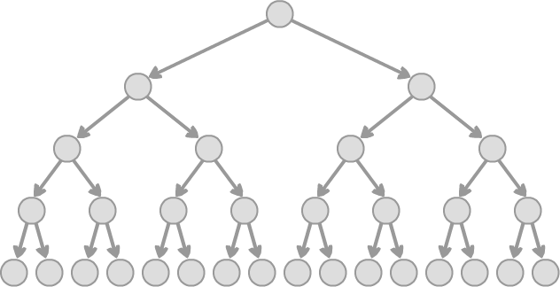

import { Link as GatsbyLink } from 'gatsby';

## Introduction - TODO

A **Tree** is a restricted type of <GatsbyLink to='/adts/8-graph'>graph</GatsbyLink> (a _connected_ _acylic_ graph to be precise). A **Tree** is a restricted type of <GatsbyLink to='/adts/8-graph'>graph</GatsbyLink> (a _connected_ _acylic_ graph to be precise). A **Tree** is a restricted type of <GatsbyLink to='/adts/8-graph'>graph</GatsbyLink> (a _connected_ _acylic_ graph to be precise). Trees..

Trees are often implemented as **binary trees**, in which each node... **Balanced** binary trees are a subset of binary trees that have the additional property that...

<figure>
  
  <figcaption> An example of a balanced binary tree. </figcaption>
</figure>

**Binary Search Trees** (BSTs) are...

Other types of trees include **chains** (like a linked list) and **stars** (root with many direct children).

## Interface - TODO

| Operation        | Description                                       |
| ---------------- | ------------------------------------------------- |
| `create()`       | Create a new tree root node                       |

## Implementations - TODO

- ???

## Read More

- [Wikipedia - Tree (data structure)](https://en.wikipedia.org/wiki/Tree_(data_structure))
- [Wikipedia - Binary Tree](https://en.wikipedia.org/wiki/Binary_tree)
- [Wikipedia - Self-Balancing Binary Search Tree](https://en.wikipedia.org/wiki/Self-balancing_binary_search_tree)
